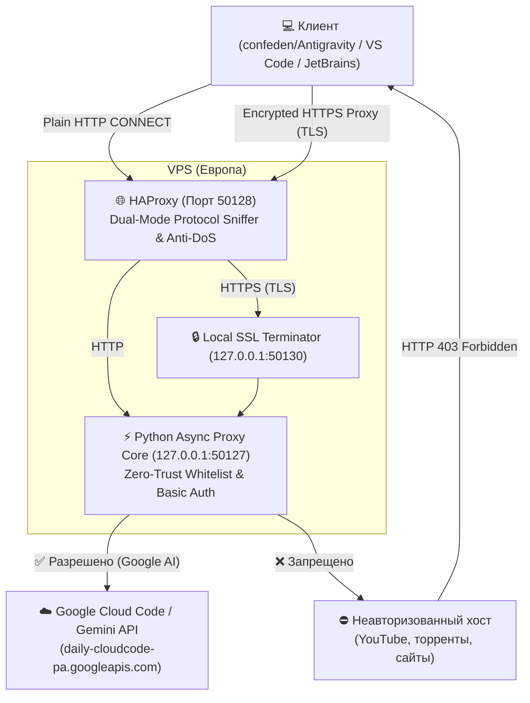

# 🚀 Antigravity Proxy Server

[](LICENSE)
[](https://www.python.org/)
[](https://www.haproxy.org/)
[](docker-compose.yml)
[](https://t.me/+8qU7020rMF84OWNi)

Высокоскоростной двухрежимный (Dual-Mode) шлюз-прокси для обхода региональных ограничений и блокировок **Google Antigravity**, **Gemini Code Assist** и **Google Cloud Code**.

Разработан специально для интеграции с клиентом [confeden/Antigravity](https://github.com/confeden/Antigravity), а также расширениями для **VS Code** и **JetBrains IDE**.

💬 **Telegram-беседа сообщества:** [https://t.me/+8qU7020rMF84OWNi](https://t.me/+8qU7020rMF84OWNi)

---

## ⚡ Особенности и преимущества

| Особенность | Обычный VPN / Общий прокси | Antigravity Proxy Server |
| :--- | :--- | :--- |
| **Ширина канала** | Забивается видео, вкладками, торрентами | **100% отдано только генерации кода** |
| **Режим входа** | Либо только HTTP, либо только HTTPS | **Двухрежимный (Dual-Mode):** авто-сниффинг HTTP CONNECT и HTTPS Proxy |
| **Проверка региона** | Часто банится Cloudflare/Google | **Честный европейский выход** (`loc=IT`/`loc=DE` в `/cdn-cgi/trace`) |
| **Безопасность** | Трафик ходит куда угодно | **Zero-Trust Whitelist:** доступ только к API Google AI, остальное блокируется (403) |
| **Защита от перегрузки**| Нет лимитов на сессии | **HAProxy Stick-Table:** лимит 30 одновременных сессий на IP от залипаний и DoS |
| **Контроль трафика** | Аварийный обрыв канала при исчерпании | **Умный Fair-Use и мягкие лимиты:** 0ms задержки для AI-токенов, сглаживание пиков до ~28 Мбит/с, мягкий шейпинг до ~3.5 Мбит/с при превышении квоты (30 ГБ/мес) без разрыва связи |
| **Производительность** | Медленный парсинг JSON с диска | **In-Memory Cache (mtime):** Мгновенная авторизация из RAM без дисковых задержек event loop |
| **Аудит и Real IP** | Теряется за реверс-прокси (`127.0.0.1`) | **HAProxy PROXY Protocol v1:** Полное сохранение реального Client IP источника в ядре и логах |
| **Безопасность демона** | Запуск под `root` | **Least Privilege:** Запуск от изолированного системного пользователя `antigravity` с флагом `NoNewPrivileges` |
| **Потребление ОЗУ** | 500+ МБ (Xray/Sing-box/Squid) | **Меньше 50 МБ RAM** (асинхронный Python 3 + HAProxy) |

---

## 🏗 Архитектура



---

## 🚀 Быстрый старт (Установка на свой VPS за 1 минуту)

### Требования к серверу:
* Любой зарубежный VPS (рекомендуются дата-центры в Европе: Нидерланды, Германия, Италия, Финляндия).
* Операционная система: **Ubuntu 20.04 / 22.04 / 24.04 / 26.04** или **Debian 11 / 12**.
* 512 МБ RAM и 1 ядро CPU (хватит даже самого дешёвого тарифа за $1.5–$3/мес).

### Автоматическая установка (в одну команду):

Подключитесь к вашему VPS по SSH под пользователем `root` и выполните:

```bash
curl -sSL https://raw.githubusercontent.com/j46871417-ui/antigravity-proxy/main/install.sh | bash
```

Скрипт автоматически:
1. Установит HAProxy, Python 3 и OpenSSL.
2. Сгенерирует локальный сертификат для режима HTTPS-прокси.
3. Настроит защиту от перегрузки (макс. 30 сессий на 1 IP).
4. Запустит и включит автозагрузку службы `antigravity-proxy.service`.
5. Выдаст готовую строку подключения для вставки в приложение:
   ```text
   https://ag_user:ВАШ_ПАРОЛЬ@IP_ВАШЕГО_СЕРВЕРА:50128
   ```

---

## 🛠 Ручная пошаговая установка

Если вы хотите развернуть всё вручную без скрипта:

### 1. Установите пакеты:
```bash
sudo apt update && sudo apt install -y haproxy python3 openssl curl
```

### 2. Клонируйте репозиторий:
```bash
git clone https://github.com/j46871417-ui/antigravity-proxy.git /opt/antigravity-proxy
cd /opt/antigravity-proxy
```

### 3. Создайте конфигурацию и сертификат:
```bash
sudo mkdir -p /etc/antigravity-proxy

# Генерация связки SSL-сертификата для HTTPS режима:
sudo openssl req -x509 -newkey rsa:2048 -nodes \
    -keyout /etc/antigravity-proxy/proxy.key \
    -out /etc/antigravity-proxy/proxy.crt \
    -days 3650 -subj "/CN=proxy.local/O=Antigravity"
sudo cat /etc/antigravity-proxy/proxy.key /etc/antigravity-proxy/proxy.crt > /etc/antigravity-proxy/proxy_bundle.pem
sudo chmod 600 /etc/antigravity-proxy/proxy_bundle.pem

# Настройка логина и пароля:
sudo cp .env.example /etc/antigravity-proxy/config.env
# Отредактируйте логин и пароль в файле:
sudo nano /etc/antigravity-proxy/config.env
```

### 4. Настройте HAProxy:
```bash
sudo cp haproxy.cfg /etc/haproxy/haproxy.cfg
sudo systemctl restart haproxy
```

### 5. Настройте службу systemd:
```bash
sudo bash -c 'cat <<EOF > /etc/systemd/system/antigravity-proxy.service
[Unit]
Description=Antigravity Zero-Trust Proxy Core
After=network.target

[Service]
Type=simple
User=root
WorkingDirectory=/opt/antigravity-proxy
EnvironmentFile=/etc/antigravity-proxy/config.env
ExecStart=/usr/bin/python3 /opt/antigravity-proxy/proxy.py
Restart=always
RestartSec=3

[Install]
WantedBy=multi-user.target
EOF'

sudo systemctl daemon-reload
sudo systemctl enable --now antigravity-proxy.service
```

---

## 🐳 Развёртывание через Docker / Docker Compose

Если вы предпочитаете Docker:

```bash
git clone https://github.com/j46871417-ui/antigravity-proxy.git
cd antigravity-proxy

# Отредактируйте логин и пароль в docker-compose.yml при необходимости
docker compose up -d --build
```

Удаление systemd-установки с резервной копией конфигурации:

```bash
sudo bash uninstall.sh --yes
```

Скрипт останавливает только `antigravity-proxy.service`, убирает файлы
этой установки и сохраняет конфигурацию в `/var/backups/antigravity-proxy`.
Общие пакеты HAProxy, Python и OpenSSL не удаляются. Для Compose сначала
выполните `docker compose down`, затем удалите проектные файлы.

---

## 💻 Подключение в клиенте Antigravity

1. Скачайте свежий релиз программы: [confeden/Antigravity](https://github.com/confeden/Antigravity/releases).
2. Запустите `Antigravity.exe` (или `tui.exe` / `tui.sh`).
3. В интерактивном меню нажмите **`1. Свой прокси`** (Own proxy).
4. Вставьте строку подключения:
   ```text
   https://ваш_логин:ваш_пароль@IP_СЕРВЕРА:50128
   ```
5. Программа проверит шлюз Google Cloud Code и подтвердит статус:
   `✅ Свой прокси включён`.
6. Открывайте **VS Code** или **JetBrains** с установленным расширением **Google Cloud Code / Gemini Code Assist** и пользуйтесь нейросетью без ограничений!

---

## 🛡 Белый список хостов (Zero-Trust Whitelist)

Прокси пропускает запросы **только** к ресурсам, строго необходимым для работы Antigravity и разработческих AI-инструментов:
* `cloudcode-pa.googleapis.com` / `daily-cloudcode-pa.googleapis.com` (генерация кода Google Cloud Code)
* `generativelanguage.googleapis.com` (Gemini API)
* `accounts.google.com` / `oauth2.googleapis.com` (авторизация аккаунта Google)
* `gemini-api-docs-mcp.dev` (официальный MCP-сервер документации Gemini API для субагентов)
* `antigravity-cli-auto-updater-*.run.app` / `*.run.app` (авто-обновление компонентов Antigravity)
* `api.openai.com` / `*.openai.com` (API OpenAI для мульти-модельных конфигураций)
* `*.googleapis.com`, `*.googleusercontent.com`, `*.gstatic.com`, `*.google.com`
* `www.cloudflare.com` (проверка региона патчером через `/cdn-cgi/trace`)
* `chatgpt.com`, `claude.ai` (резервные проверки патчера)
* **Подсети Google AS15169**: поддержка клиентов в режиме TUN / Proxifier, где DNS резолвится локально в прямые IP-адреса Google на портах 80, 443 и 5228.

Попытки использовать этот прокси для общего веб-сёрфинга, торрентов, соцсетей или загрузки сторонних файлов мгновенно отклоняются сервером (`403 Forbidden`).

---

## ⚖️ Fair-Use и мягкое шейпирование трафика (Traffic Shaping)

Чтобы гарантировать стабильность работы для всех пользователей и защитить сервер от исчерпания месячной квоты хостинга (например, 3 ТБ/мес), в ядро прокси встроен многоуровневый интеллектуальный механизм контроля трафика:

* **⚡ 0 мс добавленной задержки для AI-токенов:**
  Потоковые ответы и генерация кода передаются небольшими чанками (< 32 КБ). Для них шейпинг полностью отключен — ответы приходят с абсолютной минимальной сетевой задержкой.
* **🌊 Сглаживание пиковых скачков (Burst Rate Smoothing):**
  При передаче непрерывных тяжелых пакетов (> 32 КБ) скорость плавно сглаживается до ~28-30 Мбит/с. Это предотвращает насыщение внешнего канала сервера отдельными клиентами.
* **🛡 Мягкий месячный лимит (Soft Limit — по умолчанию 30 ГБ/мес на аккаунт):**
  При превышении порога соединение **НЕ разрывается** и аккаунт **НЕ блокируется**. Скорость мягко снижается до ~3.5 Мбит/с (400 КБ/с). Этой скорости с многократным запасом хватает для комфортной работы AI-ассистента и подсказок в IDE, но она надёжно блокирует фоновую выкачку больших объемов данных.
* **📅 Автоматический помесячный учет:**
  Статистика хранится в локальном файле `user_traffic.json` с помесячной структурой (`YYYY-MM`) и автоматически сбрасывается 1-го числа каждого месяца.
* **🔧 Тонкая настройка через переменные окружения:**
  - `USER_MONTHLY_SOFT_LIMIT_BYTES` — лимит байт в месяц (по умолчанию `32212254720` = 30 ГБ).
  - `USER_TRAFFIC_FILE` — путь к файлу статистики трафика (по умолчанию `/opt/antigravity-proxy/user_traffic.json`).

---

## 💬 Сообщество и поддержка

Если у вас появились вопросы по настройке, предложения или вы хотите обсудить проект:
👉 **[Присоединиться к нашей Telegram-беседе](https://t.me/+8qU7020rMF84OWNi)**

---

## 📄 Лицензия

Проект распространяется под открытой лицензией [MIT](LICENSE).
Свободно для использования, модификации и распространения.
